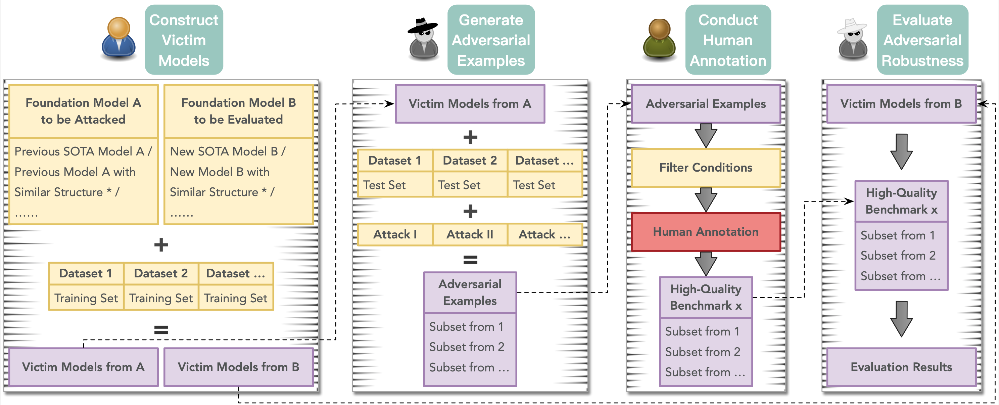
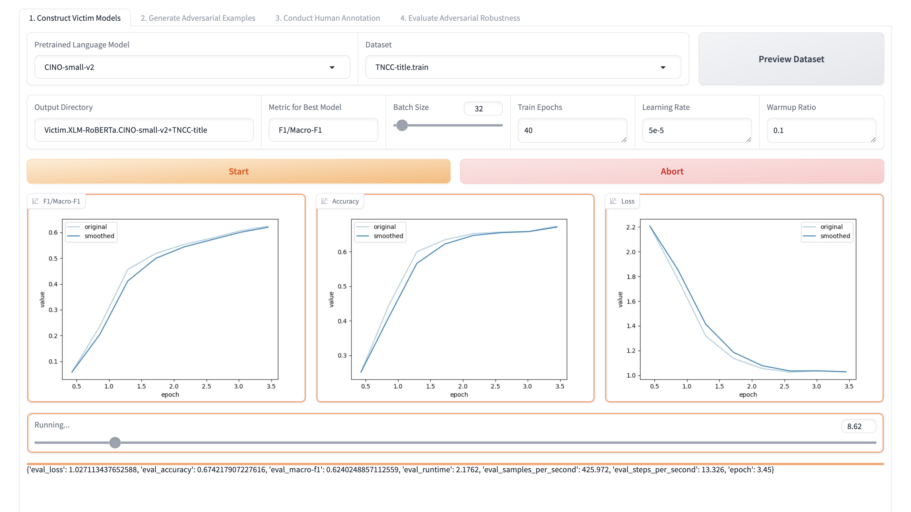
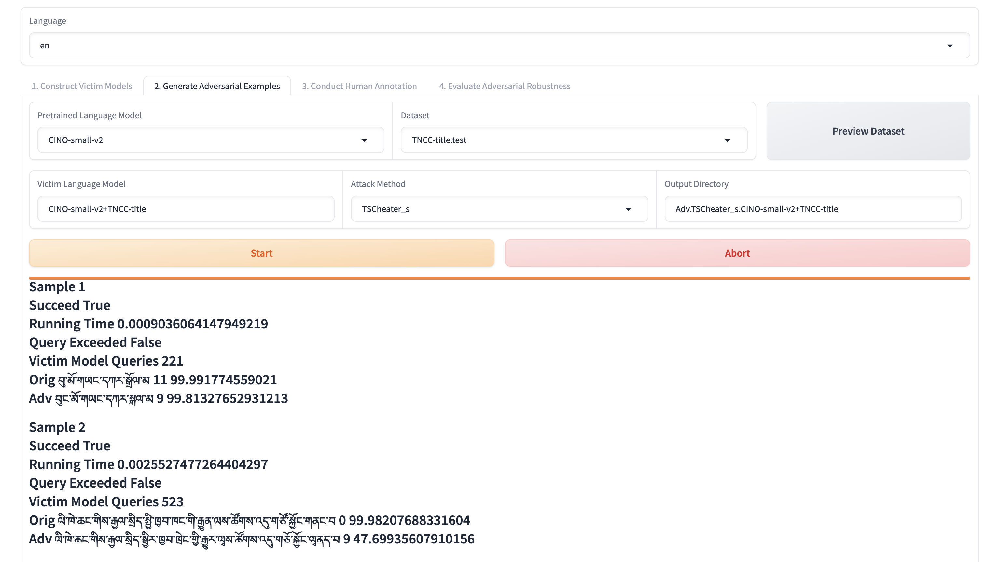
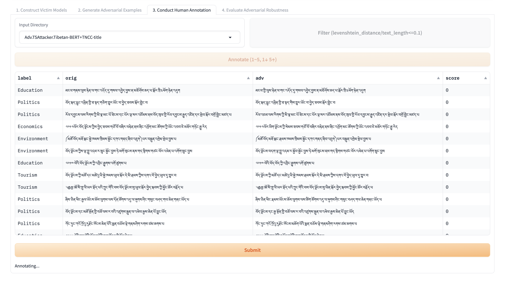
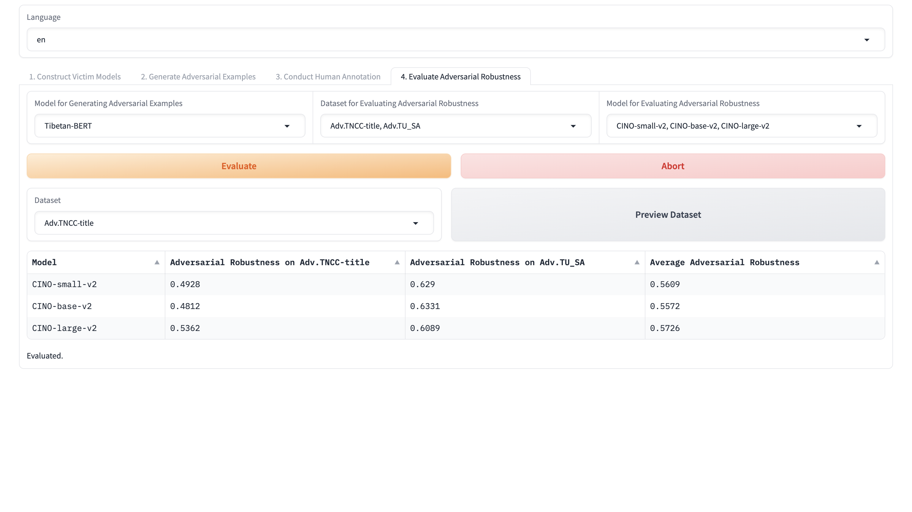

# HITL-GAT: Human-in-the-Loop Generation of Adversarial Texts

## Flowchart



## Quickstart

### Requirements

You can `python install -r requirements.txt`.

```requirements
OpenAttack==2.1.1
Levenshtein==0.26.0
psutil==5.9.8
scikit-learn==1.4.2
numpy==1.26.4
pandas==2.2.3
matplotlib==3.8.4
gradio==4.44.0
transformers==4.42.4
datasets==2.18.0
evaluate==0.4.3
accelerate==0.34.2
sentencepiece==0.2.0
torch==1.13.1+cu117
```

### Datasets

You can find the datasets in `data/Dataset.Info/all.json`.

|    Dataset    |           Directory           |                 Loader                 |
|:-------------:|:-----------------------------:|:--------------------------------------:|
| TNCC-document | `data/Dataset.TNCC-document`  | `data/Dataset.Loader/TNCC-document.py` |
|  TNCC-title   |   `data/Dataset.TNCC-title`   |  `data/Dataset.Loader/TNCC-title.py`   |
|     TU_SA     |     `data/Dataset.TU_SA`      |     `data/Dataset.Loader/TU_SA.py`     |

Also, you can customize your own datasets like above.

### Foundation Models

You can find the foundation models in `data/PLM.*.*`.

| Foundation Model |              Directory               |
|:----------------:|:------------------------------------:|
|   Tibetan-BERT   |     `data/PLM.BERT.Tibetan-BERT`     |
|  CINO-small-v2   | `data/PLM.XLM-RoBERTa.CINO-small-v2` |
|   CINO-base-v2   | `data/PLM.XLM-RoBERTa.CINO-base-v2`  |
|  CINO-large-v2   | `data/PLM.XLM-RoBERTa.CINO-large-v2` |

Also, you can customize your own foundation models like above.

### Victim Models

You can find the victim models (`data/Victim.*.*`) in [our Hugging Face collection](https://huggingface.co/collections/UTibetNLP/tibetan-victim-language-models-669f614ecea872c7211c121c) and the construction process in [our GitHub repository](https://github.com/metaphors/TibetanPLMsFineTuning).

### Others

You can find the attack assists in `data/AttackAssist.*`, the experimental logs in `Adv.*.*` and the first adversarial robustness benchmark for Tibetan script in `data/Dataset.AdvTS`.

### Start

Now, you can `python webui.py` or run the scripts under the `script` dir.

## Screenshots





